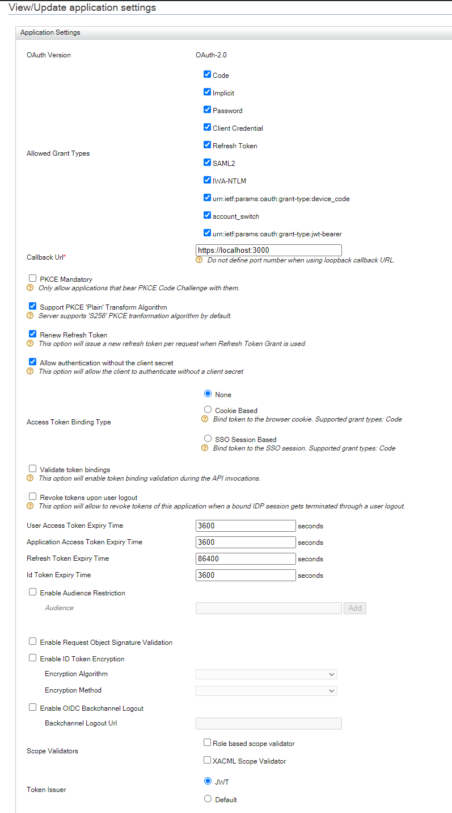

# WSO2 Identity Server no React

Nesse repositório você irá ver o básico para criar um SSO com o WSO2 Identity Server no React utilizando a biblioteca: [Asgardeo Auth React SDK](https://www.npmjs.com/package/@asgardeo/auth-react)


## Instalação

Para isso será necessário instalar o WSO2 Identity Server (v. 6.1.0) e realizar a configuração de um novo service provider e habilitar o **OAuth/OpenID Connect Configuration** em **Inbound Authentication Configuration**.
Certifique-se que as configurações estão semelhantes a essas: 


Isso irá fazer a aplicação rodar como o esperado.

## Scripts

Para rodar a aplicação react você pode utilizar os seguintes comandos:
```
set HTTPS=true&&npm start - no Windows (cmd)
($env:HTTPS = "true") -and (npm start) - no Windows (PowerShell)
HTTPS=true npm start - no Linux ou MacOS
```
A instalação do WSO2 Identity Server é por sua conta, lembre se de ativar o CORS no WSO2 Identity Server para que a aplicação React possa se comunicar com o servidor.

## Observações Importantes

- É possivel que você tenha que incluir o arquivo `src/config.json` para que a aplicação funcione corretamente.
- O arquivo `src/config.json` é onde você irá colocar as informações do seu WSO2 Identity Server.
- Será **necessário** rodar a aplicação React utilizando HTTPS, você pode consultar [React Documentation](https://create-react-app.dev/docs/using-https-in-development/) para mais informações.
